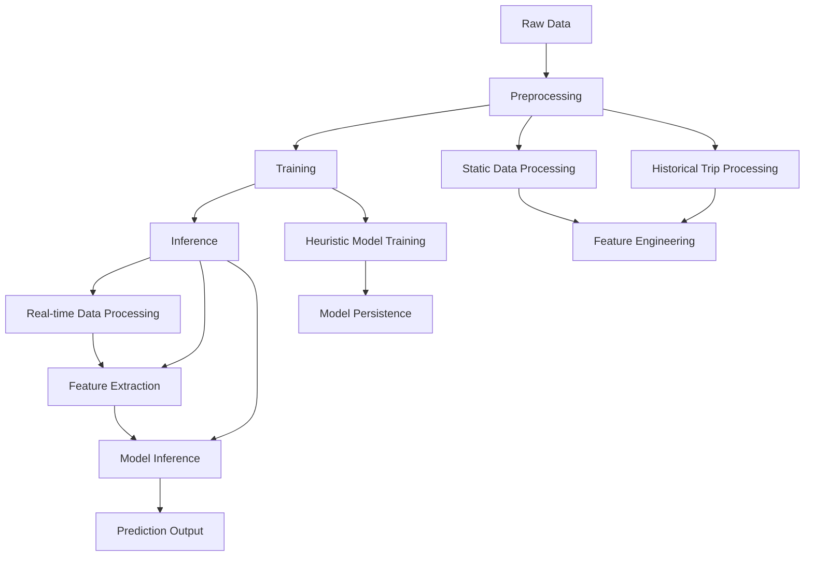

# Bangalore Last Mile Challenge - Bus Arrival Prediction System

A comprehensive Rule Engine for predicting bus arrival times in Bangalore's public transportation system using historical trip data and real-time GPS information.

## Table of Contents

- [Overview](#overview)
- [System Requirements](#system-requirements)
- [Project Structure](#project-structure)
- [Installation & Setup](#installation--setup)
- [Docker Build & Execution](#docker-build--execution)
- [Workflow Overview](#workflow-overview)
- [Notebooks & Scripts](#notebooks--scripts)
- [Dependencies](#dependencies)
- [Open Source Models](#open-source-models)
- [Usage Examples](#usage-examples)
- [Troubleshooting](#troubleshooting)

## Overview

This project implements a three-stage pipeline for bus arrival prediction:

1. **Preprocessing**: Process static data and historical trip data to create training features
2. **Training**: Train heuristic-based models using historical patterns
3. **Inference**: Real-time prediction of bus arrival times using trained models

The system uses a heuristic approach that analyzes historical travel patterns between stops under different temporal conditions to predict future arrival times.

## System Requirements

### Hardware Requirements
- **CPU**: 4+ cores recommended
- **RAM**: 8GB minimum, 16GB recommended
- **Storage**: 10GB free space for data processing
- **GPU**: Not required (CPU-only implementation)

### Software Requirements
- **Operating System**: Linux, macOS, or Windows
- **Python**: 3.9+
- **Docker**: 20.10+ (for containerized deployment)
- **Git**: For version control

### Evaluation Workstation Compatibility
The system is designed to run on standard evaluation workstations with:
- Multi-core CPU architecture
- Sufficient RAM for data processing
- Standard storage interfaces
- Docker container support

## Project Structure

```
bangalore-last-mile-challenge/
├── preprocessing/           # Data preprocessing pipeline
│   ├── src/                # Preprocessing scripts
│   ├── data/               # Raw and processed data
│   └── notebooks/          # Analysis notebooks
├── training/               # Model training pipeline
│   ├── src/                # Training scripts
│   └── models/             # Trained models
├── inference/              # Real-time prediction system
│   ├── src/                # Inference scripts
│   ├── data/               # Input/output data
│   ├── notebooks/          # Analysis notebooks
│   └── Dockerfile          # Container configuration
└── requirements.txt         # Global dependencies
```

## Local Installation & Setup

### 1. Clone Repository
```bash
git clone <repository-url>
cd bangalore-last-mile-challenge
```

### 2. Create Conda Environment
```bash
# Create conda environment
conda create -n blmc python=3.9

# Activate environment
conda activate blmc
```

### 3. Install Additional Dependencies
```bash

# Install dependencies
conda install -c conda-forge --file requirements.txt

# Install geopandas and spatial libraries (If above gives error)
conda install -c conda-forge geopandas pyarrow
```

## Docker Build & Execution

### Building the Docker Image

The inference system is containerized for easy deployment. Follow these steps to build and run the Docker image:

#### Step 1: Build the Docker Image
```bash
cd inference
docker build --platform linux/amd64 -t gouherdanishiitkgp/blmc-docker-repo:v2 .
```

#### Step 2: Prepare Data Volumes (For Illustration Purpose)
```bash
# Create data directories
mkdir -p data/eval_data

# Copy your input data
cp your_trip_data.parquet data/eval_data/

# Create input.json
cd data
touch input.json
```

**Input Json Format**
```json
{
  "1":"eval_data/your_trip_data.parquet"
}

#### Step 3: Run the Container
```bash
# Run with data volumes mounted
docker run -v $(pwd)/data:/app/data \
           -v $(pwd)/out:/app/out \
           gouherdanishiitkgp/blmc-docker-repo:v2
```

#### Step 4: Alternative Run Command
```bash
# Run with specific input/output files
docker run -v $(pwd)/data:/app/data \
           -v $(pwd)/out:/app/out \
           gouherdanishiitkgp/blmc-docker-repo:v2 \
           --input-json /app/data/input.json \
           --output-json /app/out/output.json
```

### Docker Configuration Details

The Dockerfile includes:
- **Base Image**: Python 3.9-slim
- **System Dependencies**: GDAL, PROJ, spatial libraries
- **Python Dependencies**: All required packages with specific versions
- **Working Directory**: `/app` with data and output subdirectories
- **Entry Point**: Automated prediction pipeline

## Workflow Overview



### 1. Preprocessing Stage
- **Static Data Processing**: Process bus stops, routes, and sequences
- **Historical Trip Processing**: Extract features from historical GPS data
- **Feature Engineering**: Create temporal, spatial, and route-specific features

### 2. Training Stage
- **Pattern Analysis**: Analyze historical travel patterns
- **Model Training**: Train heuristic models using statistical patterns
- **Model Persistence**: Save trained models for inference

### 3. Inference Stage
- **Real-time Processing**: Process live trip data
- **Feature Extraction**: Extract features for prediction
- **Model Inference**: Generate arrival time predictions

## Notebooks (Not used for Production)

### Preprocessing Notebooks 
- **`demo.ipynb`**: Demonstration of preprocessing pipeline
- **`explore.ipynb`**: Data exploration and analysis
- **`rough.ipynb`**: Experimental analysis and prototyping

### Inference Notebooks
- **`live_predict.ipynb`**: Live prediction demonstrations
- **`model_patterns.ipynb`**: Model pattern analysis and visualization
- **`create_test_data.ipynb`**: Test data generation utilities

### Key Scripts (Used)

#### Preprocessing Scripts
- **`static_data_processor.py`**: Process static reference data
- **`training_data_generator.py`**: Generate training features from historical data

#### Training Scripts
- **`model_train.py`**: Train heuristic models
- **`model.py`**: Heuristic model implementation

#### Inference Scripts
- **`predict.py`**: Main prediction pipeline
- **`test_data_processor.py`**: Real-time data processing
- **`feature_pipeline.py`**: Feature extraction for inference

## Dependencies

### Core Dependencies
```
numpy==1.26.4
pandas==2.1.4
pyarrow==14.0.2
geopandas==0.14.2
fiona==1.9.5
shapely==2.0.4
pyproj==3.6.1
rtree==1.3.0
```

### Additional Dependencies
```
matplotlib
seaborn
jupyter
```

### System Dependencies (Docker)
```
gcc g++ libspatialindex-dev libproj-dev proj-data proj-bin gdal-bin
```

## Open Source Models

This project uses the following open-source libraries and models:

### Geographic Processing
- **GeoPandas**: Geographic data processing and analysis
- **Fiona**: Vector data I/O operations
- **Shapely**: Geometric operations
- **PyProj**: Coordinate transformations
- **GDAL**: Geospatial data abstraction library

### Data Processing
- **Pandas**: Data manipulation and analysis
- **NumPy**: Numerical computing
- **PyArrow**: Columnar data processing

### Visualization
- **Matplotlib**: Plotting and visualization
- **Seaborn**: Statistical data visualization

## Usage Examples

### Complete Pipeline Example

#### 1. Preprocessing
```bash
# Process static data
cd preprocessing/src
python static_data_processor.py \
  --data-path ../data/raw \
  --output-path ../data/processed

# Generate training data
python training_data_generator.py \
  --raw-data-path ../data/raw/trip_data/BMTC_17_august_to_19_august \
  --processed-data-path ../data/processed \
  --dates "date=2025-08-17,date=2025-08-18,date=2025-08-19" \
  --max-routes 10
```

#### 2. Training
```bash
# Train model
cd ../../training/src
python model_train.py \
  --processed-data-path ../../preprocessing/data/processed \
  --model-path ../models
```

#### 3. Inference
```bash
# Run predictions
cd ../../inference/src
python predict.py \
  --input-json ../data/input.json \
  --output-json ../data/output.json
```

### Docker Deployment Example
```bash
# Build and run with Docker
cd inference
docker build --platform linux/amd64 -t gouherdanishiitkgp/blmc-docker-repo:v2 .
docker run -v $(pwd)/data:/app/data gouherdanishiitkgp/blmc-docker-repo:v2 --input-json /app/data/input.json --output-json /app/out/output.json
```

## Input/Output Format

#### Input JSON Format
```json
{   
  "1":"path_to_the_parquet_file",   
  "2":"path_to_the_parquet_file",
 }
```

#### Output JSON Format
```json
{ 
  "route_id":{"stop_id":"time_stamp", "stop-id2":"time_stamp"}, 
  "route_id":{"stop_id":"time_stamp", "stop-id2":"time_stamp"}
}
```

## Troubleshooting

### Common Issues

#### 1. Missing Dependencies
```bash
# Install missing spatial libraries
conda install -c conda-forge geopandas fiona shapely pyproj rtree
```

#### 2. Docker Build Failures
```bash
# Clean Docker cache
docker system prune -a

# Rebuild with no cache
docker build --no-cache -t gouherdanishiitkgp/blmc-docker-repo:v2
#### 3. Data Processing Errors
```bash
# Check data format
python -c "import pandas as pd; print(pd.read_parquet('your_file.parquet').head())"
```

#### 4. Model Loading Issues
```bash
# Verify model file exists
ls -la models/model.pkl

# Check model integrity
python -c "import pickle; print(pickle.load(open('models/model.pkl', 'rb')).keys())"
```

### Performance Optimization

#### Memory Management
- Process data in smaller batches
  - Use `--max-routes` parameter to limit processing
  - Use `--include-routes` to only process for selected routes
  - Use `--exclude-routes` to process for all routes other than the selected routes
- Monitor memory usage during training

#### Processing Speed
- Use SSD storage for faster I/O
- Enable parallel processing where possible
- Optimize data formats (use parquet)

### Logging and Debugging

#### Enable Debug Logging
```python
import logging
logging.basicConfig(level=logging.DEBUG)
```

#### Check Log Files
```bash
# Preprocessing logs
tail -f preprocessing/src/logs/static_data_processor.log

# Training logs
tail -f training/src/logs/model_train.log

# Inference logs
tail -f inference/src/logs/predict.log
```

## Evaluation Notes

### System Compatibility
The solution is designed to run on standard evaluation workstations with:
- Multi-core CPU architecture
- Sufficient RAM for data processing
- Docker container support
- Standard storage interfaces

### Performance Expectations
- **Preprocessing**: 10-30 minutes for 1 route for 1 day
- **Training**: 5-15 minutes for heuristic models
- **Inference**: Real-time processing (< 1 second per route)

### Data Requirements
- Historical trip data in parquet format
- Static reference data (stops, routes, sequences)
- GPS coordinates with timestamps
- Route and stop identifiers

## Contributing

### Code Style
- Follow PEP 8 guidelines
- Use type hints where appropriate
- Document functions and classes
- Maintain consistent logging

## License

This project is developed for the Bangalore Last Mile Challenge and follows the competition guidelines and requirements.

## Support

For issues and questions:
1. Check the troubleshooting section
2. Review log files for error details
3. Verify system requirements
4. Ensure all dependencies are installed correctly

---

**Note**: This system is designed for the Bangalore Last Mile Challenge and requires specific data formats and configurations as outlined in the competition guidelines.
